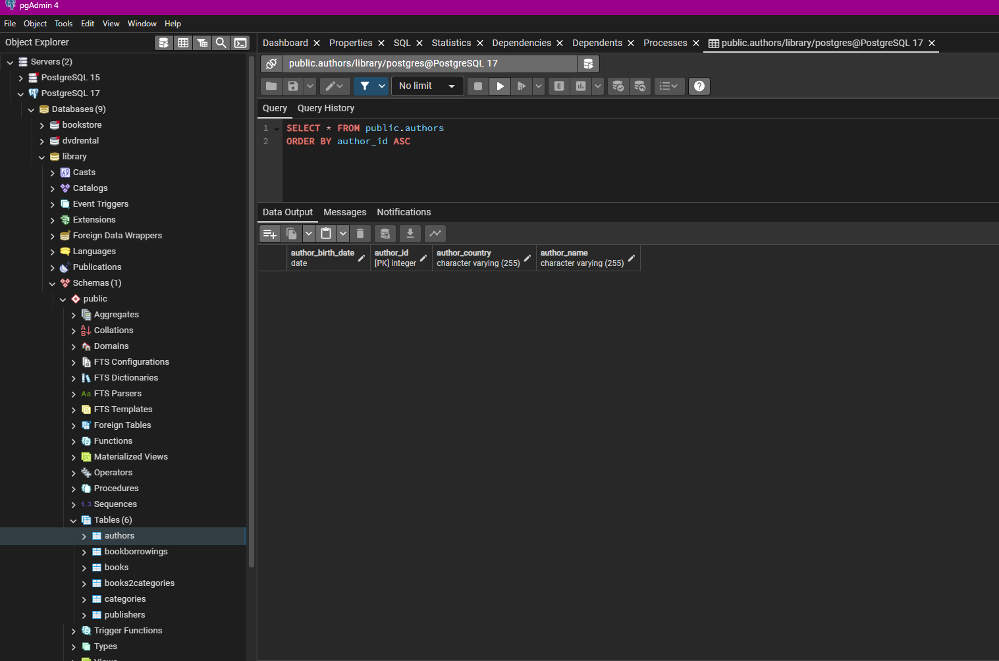
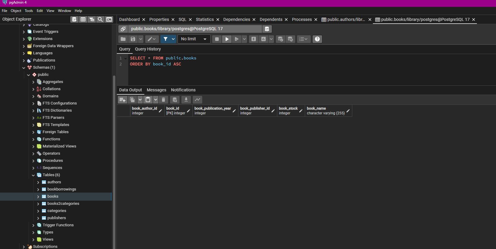
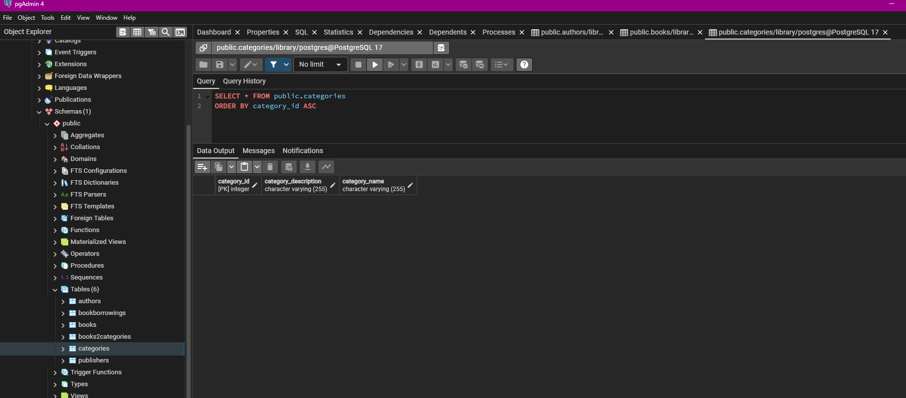
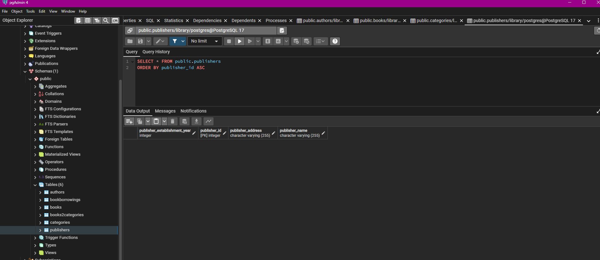
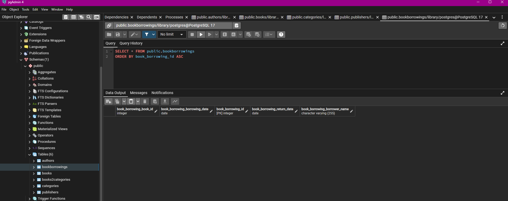
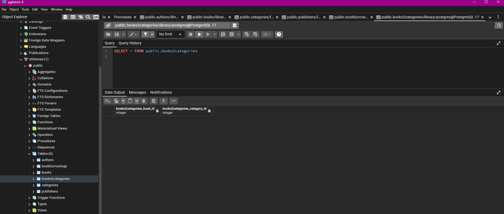

# Library Management System

   

A simple **Library Management System** implemented with Jakarta Persistence (JPA) and Hibernate, backed by a PostgreSQL database. This project demonstrates entity mappings, relationships, and basic schema generation using a standalone Java application.

---

## Table of Contents

* [Overview](#overview)
* [Project Structure](#project-structure)
* [Prerequisites](#prerequisites)
* [Installation](#installation)
* [Configuration](#configuration)
* [Running the Application](#running-the-application)
* [Database Schema](#database-schema)
  * [Authors Table](#authors-table)
  * [Books Table](#books-table)
  * [Categories Table](#categories-table)
  * [Publishers Table](#publishers-table)
  * [BookBorrowings Table](#bookborrowings-table)
  * [Books2Categories Table](#books2categories-table)
* [FAQs](#faqs)
* [Contributing](#contributing)

---

## Overview

This project provides a console-based Java application (`App.java`) that uses JPA to define five core entities (**Author**, **Book**, **Category**, **Publisher**, **BookBorrowing**) and a join table (`books2categories`) in a PostgreSQL database. It covers:

* One-to-Many, Many-to-One, and Many-to-Many relationships
* `GenerationType.IDENTITY` primary keys
* Fetch and cascade strategies
* Implicit join table creation for Many-to-Many
* Initial `NULL` handling for `returnDate`

---

## Project Structure

```
library-management-system
├── pom.xml
├── src
│   ├── main
│   │   ├── java
│   │   │   └── org.velihangozek.library
│   │   │       ├── App.java
│   │   │       ├── Author.java
│   │   │       ├── Book.java
│   │   │       ├── Category.java
│   │   │       ├── Publisher.java
│   │   │       └── BookBorrowing.java
│   │   └── resources
│   │       └── META-INF
│   │           └── persistence.xml
│   └── test
└── README.md
```

---

## Prerequisites

* Java 21 SDK installed
* Apache Maven 3.6+
* PostgreSQL 17+

---

## Installation

1. Clone the repository:

   ```bash
   git clone https://github.com/velihangozek/java-backend-practices.git
   cd Week-12/library-management-system
   ```
2. Create a PostgreSQL database named `library`:

   ```sql
   CREATE DATABASE library;
   ```
3. Update credentials if needed in `src/main/resources/META-INF/persistence.xml`.

---

## Configuration

Edit `src/main/resources/META-INF/persistence.xml`:

```xml
<property name="jakarta.persistence.jdbc.url" value="jdbc:postgresql://localhost:yourdedicatedporthere/library"/>
<property name="jakarta.persistence.jdbc.user" value="yourusernamehere"/>
<property name="jakarta.persistence.jdbc.password" value="yourpasswordhere"/>
```

The **hibernate.hbm2ddl.auto** property is set to `create-drop` by default, so tables will be created on startup and dropped on shutdown.

---

## Running the Application

From the project root:

```bash
mvn compile exec:java -Dexec.mainClass="org.velihangozek.library.App"
```

This will initialize the schema and exit (no CLI beyond schema generation). Check the console for generated SQL statements.

---

## Database Schema

### Authors Table



### Books Table



### Categories Table



### Publishers Table



### BookBorrowings Table



### Books2Categories Table



---

## FAQs

**Q: Is the `books2categories` table an Entity?**
**A:** No. In JPA, the join table for a Many-to-Many relation is generated implicitly by Hibernate and is not mapped to a separate Java class annotated with `@Entity`. It’s managed behind the scenes by your `@ManyToMany` annotations.

---

## Contributing

Feel free to open issues or pull requests to improve entity mappings, schema design, or add CRUD operations and service layers.

---